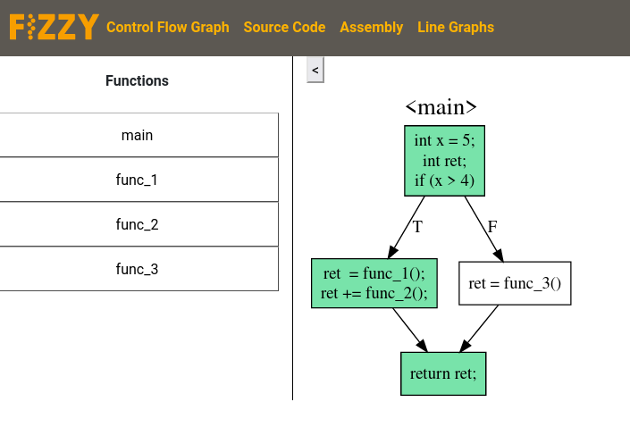
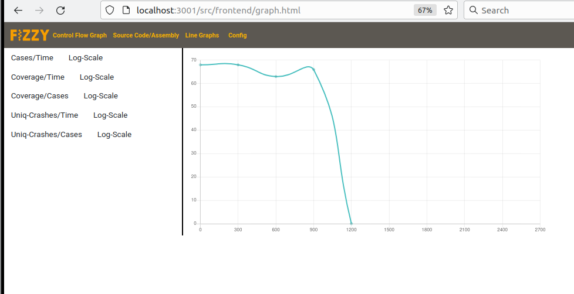

<p align="center">
<font size="+3"><B>Team Gimel</B></font> <br>
<font size="+2">Fizzy - A fuzzer visualizer</font><br>
<font size="+2">Fall 2022</font>
</p>

#### Overview

This project is a tool for data visualization. The application is targeted at small groups of
power-users (such as vulnerability researchers) that are interested in a shared data visualization
instance. This application is meant to be ran as a private instance being hosted locally by the
respective teams.

The application enables multiple users to review and annotate the displayed data. Users will be
provided with multiple formats of data visualization to best suit their needs.

It is mainly intended to be used with program analysis tooling such as fuzzers/tracers that emit a
lot of structured data that would benefit from human readable visualization, and our given layouts
are configured with that in mind.

This tool is innovative because such specialized data visualization tools are rare and aren't
commonly used for the most part.

To that end we provide the following functionalities:


#### Team Members
- Gilbert Hoermann - seal9055
- Dung Nguyen - dungwinux
- Ronan Salz - rsalz47

#### User Interaface
- This is the initial Dashboard displayed when the site is first opened by a logged in user. It
displays a window with notes shared between team members (these can be edited here too), a table
describing the users currently on this project, and 2 tables displaying various high level
statistics about the project. New projects can also be registered here. This page is meant to
provide a brief initial overview.


- This page has 2 main views (left and right). Left lists all the functions found in this project
while right displays a control-flow-graph for each function. Different graphs can be opened by
clicking on different functions in the view. Since this graph is meant to showcase coverage data for
a fuzzer to an analyst, basic blocks that have been hit are marked green while basic blocks that
aren't hit are white.


- The Line Graph tab offers users further means of visualization of fuzzer output data. It is
divided into two views: the left hand side presents a list of checkable options to modify the
manner in which the graphs are drawn and the right, which displays the actual graphs. The names of
the buttons on the left view describe what the given graph will represent. A log-scale option is
also available for each graph.


- This screenshot showcases the 'Manage Users' tab. As the name describes it allows for some
simple user management. The "Remove User"" functionality is only available to admin users.


- This is the login window. It is the view that a user will use to register an account and log into the application.


- The source code and assembly tabs share the same structure and view.
On the left side is a sidebar listing all files related to the project.
On the right side is the text view screen, displaying all the content of the
selected file. If it is source code in the text file, the viewer supports
syntax highlighting and searching inside the window. The viewer also allows
marking comments submitted by users collaborating on the project.


#### API Documentation
Usage examples for these API's are in `src/frontend/js/client.js`

##### server/server.js
> `POST comments/create`
This API is used to insert a new comment into the server-side DB. The web-app uses it to insert
notes using the message-field in the leftmost view of index.html.
Expected body:
```json
{
    "timestamp": "string",
    "user": "string",
    "msg": "string",
    "id": "number"
}
```

> `POST /comments/read`
This API is used to read all the currently existing notes from the server-side db. It is used to
display the notes in the leftmost view of index.html, as well as continuously refresh the comments
on the user-facing display.

> `POST /comments/update`
This API is used to update existing comments. It reads out a comment from the database, and changes
its data field based on the changes requested by the user.
Expected body:
```json
{
    "idToUpdate": "number",
    "newText": "string",
}
```

> `POST /comments/delete`
This API is used to delete an existing comment. It takes in a note id and uses it to delete a note
from the server-side db.
Expected body:
```json
{
    "idToDelete": "number",
}
```

> `GET /cfg/function_list`
This API is used to return a list of function names for the target. This API's usecase basically
mirrors just running objdump on the target binary with the option to just look for function nanmes.

> `POST /cfg/cfg_for_func`
This API takes in a function name and queries the targets cfg-object to return the control flow
graph for the function corresponding to the name.
Expected body:
```json
{
    "func_name": "string",
}
```

> `GET /project/data`
Gets the data for all available projects

> `POST /project/init`
Initialize database by adding empty/0-initialized data to it, so we have an initial state that we
can retrieve/display on the site.
Expected body:
```json
{
    "name":       "string",
    "fuzzer":     "string",
    "target":     "string",
    "input_dir":  "string",
    "output_dir": "string",
    "time_stamp": "string",
}
```

##### server/routes/user.js
> `GET /users`
This API returns information about all users

> `GET /users/:id`
This API takes in a user `id` from the get request to it and uses it to return the data about a
user-account.

> `POST /users/verify`
This API validates a username/password from the data of a post request and communicates if this is
a valid combination for an existing user.
Expected body:
```json
{
    "username": "string",
    "password": "string",
}
```

> `POST /users/register`
This API takes in a username/password from the data of a post request and uses it to register a new
user to the server-side db.
Expected body:
```json
{
    "username": "string",
    "password": "string",
}
```

##### server/routes/stat.js

> `GET /stats`
This API returns a single row of data from the statistics database representing the current state of
the fuzzing campaign.

> `POST /stats`
This api is meant to be accessed by the fuzzer. The fuzzer sends its data to it, which is then
inserted into the database.
Expected body:
```json
{
    "total_cases": number,
    "crashes": number,
    "ucrashes": number,
    "coverage": number,
    "cmpcov": number,
    "exec_time": number,
    "instr_count": number,
    "timeouts": number,
}
```

> `GET /stats/all`
This API returns all the statistics data that populates the database for the current fuzzing
campaign.

> `GET /stats/cov`
This API is used to return an array that represents all the basic blocks that have been hit by the
fuzzer, thus allowing the cfg visualization to color graph nodes based on this information.

> `POST /stats/cov`
This API is used by the fuzzer to transmit new coverage data.
Expected body:
```json
Array[numbers]
```

##### server/routes/source.js

> `GET /sources/list`
This API acquires available files listed in `project_dir/` in the server.

> `GET /sources/file?path={p}`
This API acquires file with path `p` in `project_dir/`. If the file does not
exist, 404 returned.

#### Database-Documentation

##### > Relational Databases (stored in project\_dir/db)
> Comments
```
                       Table "fizzy.comments"
  Column   |          Type          |             Description             |
-----------+------------------------+-------------------------------------+
 id        | integer                | Unique id of this comment           |
 comment   | text                   | Actual comment data                 |
 timestamp | text                   | Timestamp when comment was created  |
 name      | character varying(255) | Name of user that made this comment |
```

> Project
```
               Table "fizzy.projects"
   Column   | Type |             Description                 |
------------+------+-----------------------------------------+
 name       | text | Unique name of the current Project      |
 fuzzer     | text | Name of fuzzer used in this project     |
 target     | text | Path to target being fuzzed             |
 input_dir  | text | Path to corpus used to seed the fuzzer  |
 output_dir | text | Path to outputs generated by fuzzers    |
 timestamp  | text | Date when this fuzzing campaign started |
```

> Stats
```
                  Table "fizzy.stats"
    Column    |  Type  |                 Description                   |
--------------+--------+-----------------------------------------------+
 cases_total  | bigint | Total number of fuzz-cases executed           |
 crash_total  | bigint | Total number of triggered crashes in target   |
 crash_unique | bigint | Unique crashes triggered in target            |
 run_time     | bigint | Runtime of fuzzer at this stat-entry          |
 coverage     | bigint | Total code-coverage generated in target       |
 cmp_cov      | bigint | Total comparison-coverage generated in target |
 instr_count  | bigint | Total instruction-count executed thus far     |
 timeouts     | bigint | Total number of triggered timeouts in target  |
```

> Users
```
                            Table "fizzy.users"
 Column |          Type          |                 Description             |
--------+------------------------+-----------------------------------------+
 id     | integer                | Unique id for this user                 |
 name   | character varying(255) | Username                                |
 role   | character varying(1)   | Role of this user ('A'=Admin, 'U'=User) |
 handle | character varying(255) | Public Handle used to identify user     |
```

> Users credential
```
                Table "fizzy.credentials"
 Column |      Type      |            Description             |
--------+----------------+------------------------------------+
 id     | integer        | Unique user id                     |
 hash   | character(128) | Computed hash for salted password  |
 salt   | character(32)  | Salt used for the password         |
```

##### > Other persistent storage in use
> project\_dir/simple\_test.c & project\_dir/simple\_test.s
```
Source files used to populate our source-code and assembly views
on the site
```

> project\_dir/simple\_test
```
Compiled binary of the simple_test.c file. This executable is used to generate cfg.json
and for the fuzzer to execute so that it can dynamically generate data.
It is compiled for the RISCV architecture to be compatible with the fuzzer in use.
```

> project\_dir/cfg.json & decompiler\_script.py
```
cfg.json is a control-flow graph that was generate using decompiler_script.py and
the api of a decompiler. The format of it is described below.
{
    "function_name": {
        "control-flow blocks": [
            {
                "memory-address of this block": <addr>,
                "instructions in this block": [
                    "<instr_1>",
                    "<instr_2>".
                ]
            },
        "edges mapping blocks to each other" [
            [
                block_id_0
                block_id_1
            ],
        ]
    },
}
```
#### URL Routes/Mappings


#### Authentification/Authorization
Account creation and logging into existing accounts is done through the `/src/frontend/login.html`
route. There is 1 default admin user, all other users are created using more restricted user perms.
Every aspect of the site, excluding login.html, requires at least user permissions. Editing config
data is restricted to the admin user. Attempting to access a route without being logged into a
session redirects to login.html

- Done through the login.html page
- 1 default admin user, all other users have user perms
- Every single aspect of the site outside of login.html requires at least user perms
- Editing config data requires admin privs
- Attempting to access a route without being logged in redirects to login.html

#### Division of Labor
Throughout our entire project, we had a very consistent workflow. For every milestone, we met
together for one or two nights and had 6-10 hour sprints to complete the relevant work. During
this time, we were all located in the same room, sitting at the same table, working on the same repo (on
different branches, of course). While there was the odd commit here and there that one team member did individually,
we all consider this project to be done by all three of us in exactly equal parts.

#### Conclusion
The most tangible conclusion our group can take away from this project is that none of us are
particularly inclined to front end work. We found the most difficulty present at the first milestone
of the project: HTML/CSS formatting, learning how to incorporate Bootstrap library elements into our
code, abiding by the "Seperation of Concerns," and so on. We found ourselves wishing these more
advanced elements of front end, such as more sophisticated CSS features and external library calls,
had come up more in the course through lab exercises.

This is not to say that the experience wasn't valuable, far from it: as we progressed further 
"backward" in our web app, into the realm of
middleware and back-end development, we felt like we really hit our stride. These parts came
fairly easy to our group, and we felt the course material really complemented the tasks we were
assigned for these milestones. We did encounter some last minute difficulties pertaining to
Heroku's free tier cancellation, though we acknowledge that this was something far beyond the
control of course staff.

In sum, our group found this entire experience gratifying. Through all the trials and
tribulations we laughed, we cried, and altogether grew closer as a team. We learned patience, we
learned anger management, and we learned to fix more merge conflicts than we thought possible. 
We found the end product to be immensely satisfying, and were ecstatic to see a working front end 
visualize sophisticated data relevant to our own individual passions: reverse engineering and 
vulnerability research.

