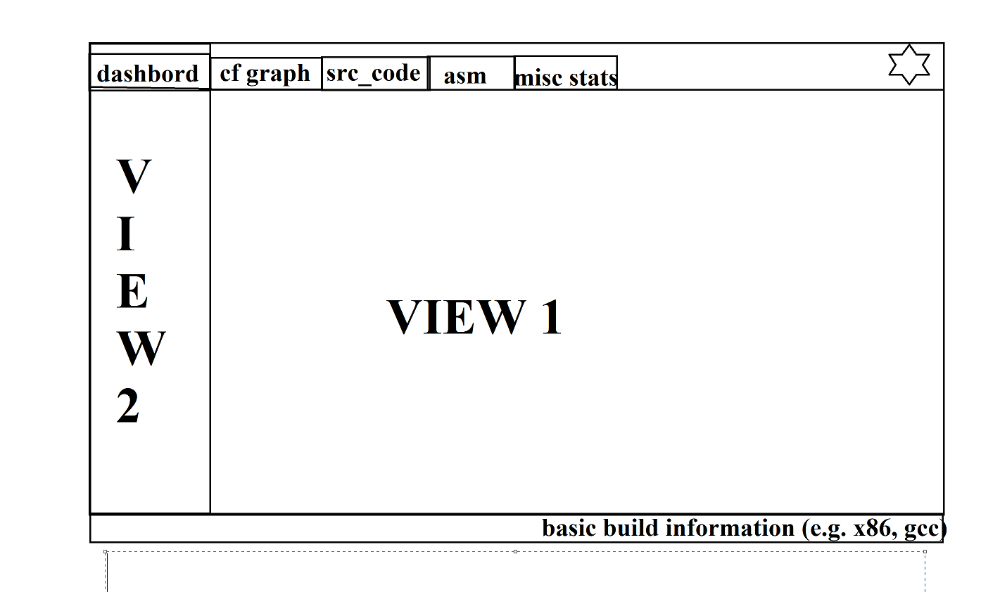
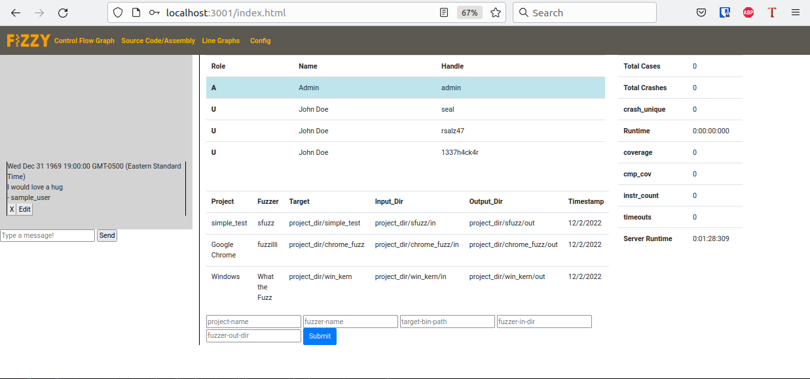
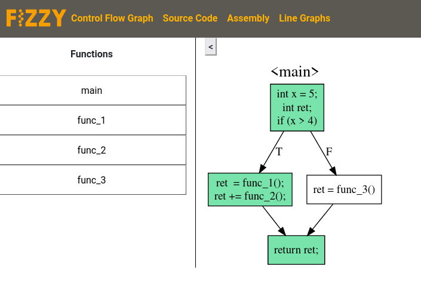
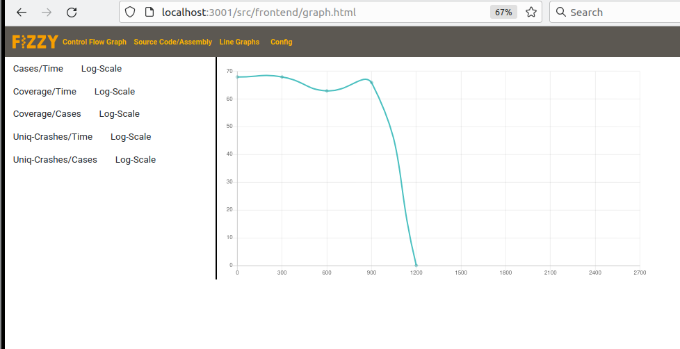
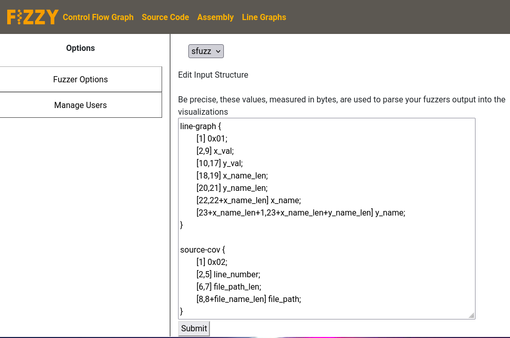
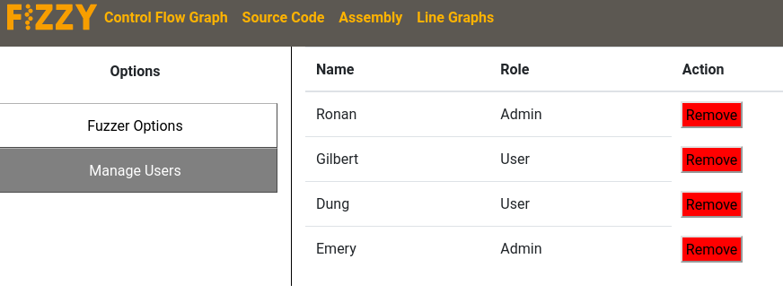
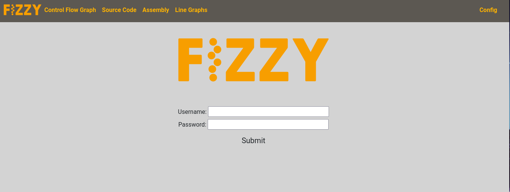
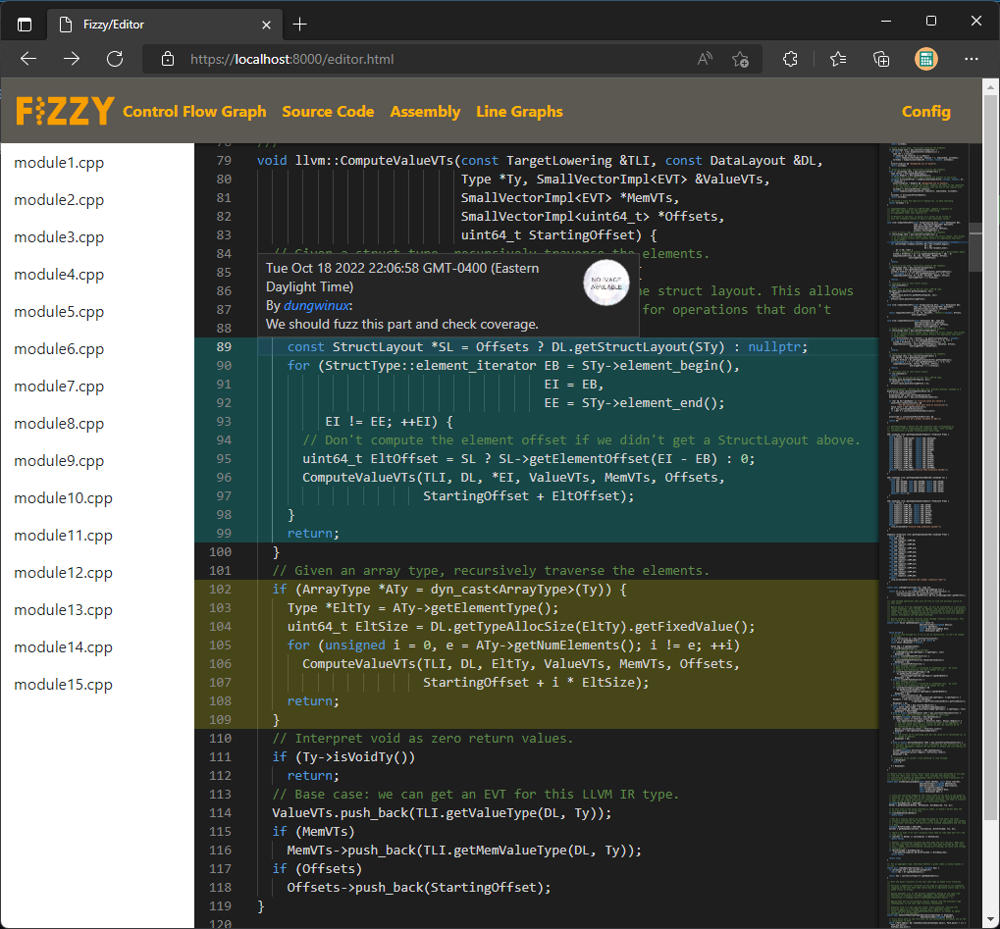

## Milestone 1

#### Data Interactions
1. Configuration data stored in the sql database, it can be viewed and edited through the
   application
2. Comments - Users are able to add comments to the project. These are also stored in an sql
   database
3. Source-code and binary of the target application so we can parse out our source-code and cfg
   views
4. Information sent to us by the fuzzer is also stored in the database and updated in realtime as
   more data comes in. This includes things like coverage data, runtime, crashes, etc.

#### Wireframes
The below picture represents the basic layout of our site. We intend to have multiple tabs to
showcase different views. Each of these tabs then has 2-3 different views for the user to interact
with.

#### Page screenshots
- This is the initial Dashboard displayed when the site is first opened by a loged in user. It
displays a window with notes shared between team members, a table describing the users currently on
this project, and 2 tables displaying various high level statistics about the project. This page is
meant to provide a brief initial overview.

- This page has 2 main views (left and right). Left lists all the functions found in this project
while right displays a control-flow-graph for each function. Different graphs can be opened by
clicking on different functions in the view. Since this graph is meant to showcase coverage data for
a fuzzer to an analyst, basic blocks that have been hit are marked green while basic blocks that
aren't hit are white. Additionally the analyst can click on a function call within a block to
open the graph for that function. The back button can then be used to return to the previous
function.

- The Line Graph tab offers users further means of visualization of fuzzer output data. It is divided into two views: the left hand side presents a list of checkable options to modify the manner in which the graphs are drawn. Besides making a graph visible or hidden, each graph also has an individual checklist of options to change things such as the scales of axes and further relevant metrics.

- The config tab once again has multiple views. The left view is used to chose an option window
while the right view displays this view. This first screenshot demonstrates the 'fuzzer options'
view which lets a user chose a fuzzer and define a parse structure that will be used to parse inputs
from the fuzzer into the various graphs we are displaying in this application.

- This screenshot showcases the 'Manage Users' tab. As the name describes it just allows for some
simple user management.

- This is the login window. It is currently not routed to yet, but it can be accessed at
'/login.html' and is the view that a user will use to log into the application.

- The source code and assembly tabs share the same structure and view.
On the left side is a sidebar listing all files related to the project.
On the right side is the text view screen, displaying all the content of the
selected file. In it is source code in the text file, the viewer supports
syntax highlighting and searching inside the window. The viewer also allows
marking comments submitted by users collaborating on the project.

#### Work Breakdown
We did almost all of the work on this project together in one room, so we all spent approximately
the same amount of time on this project. We were able to split the project up fairly well during
this time with everyone working on different tabs. Everyone worked together on the dashboard and
navigation bar to get the initial project/idea started. Afterwards we branched out with Ronan
focusing on the line graph views, Dung on the code editor & assembly views, and Gilbert on the cfg
and configs.
