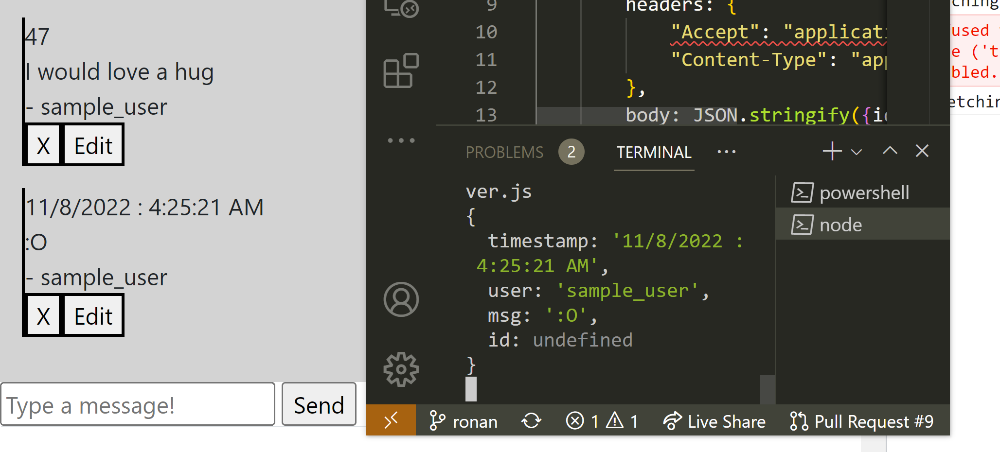
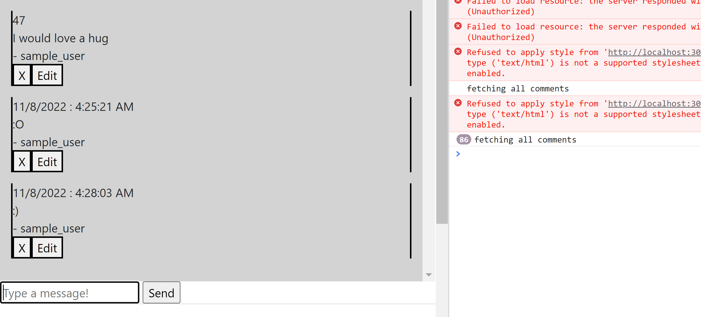
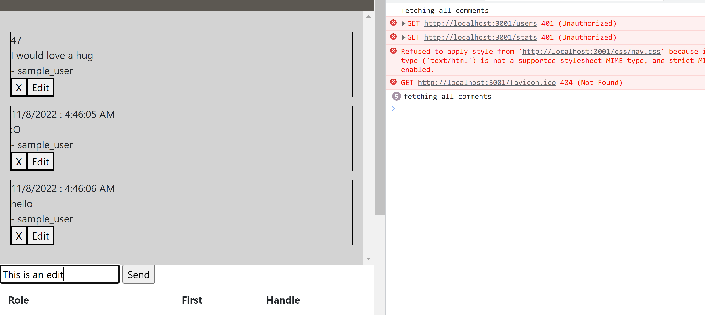
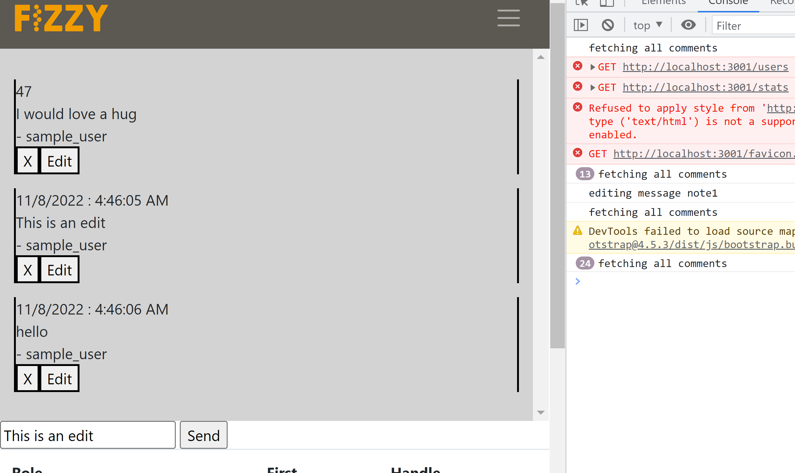
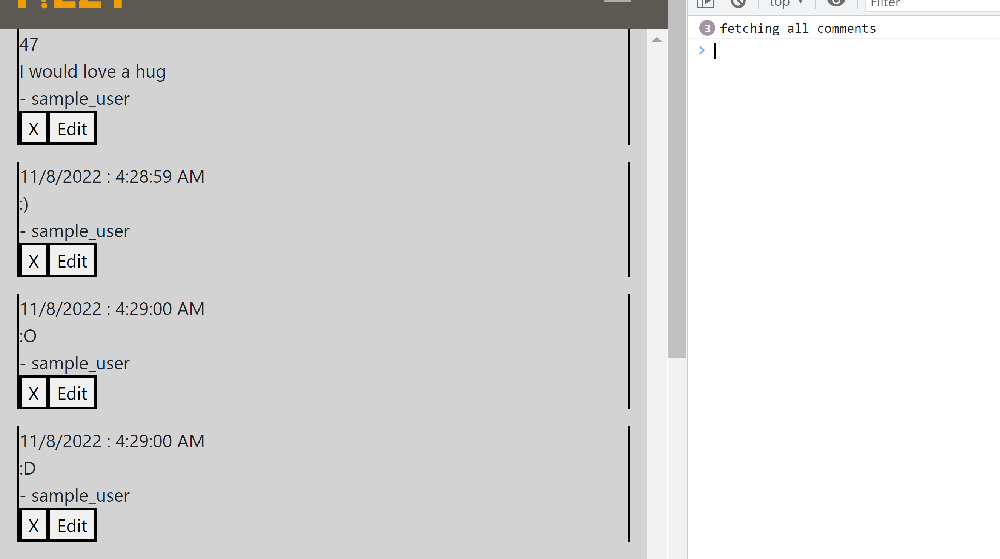
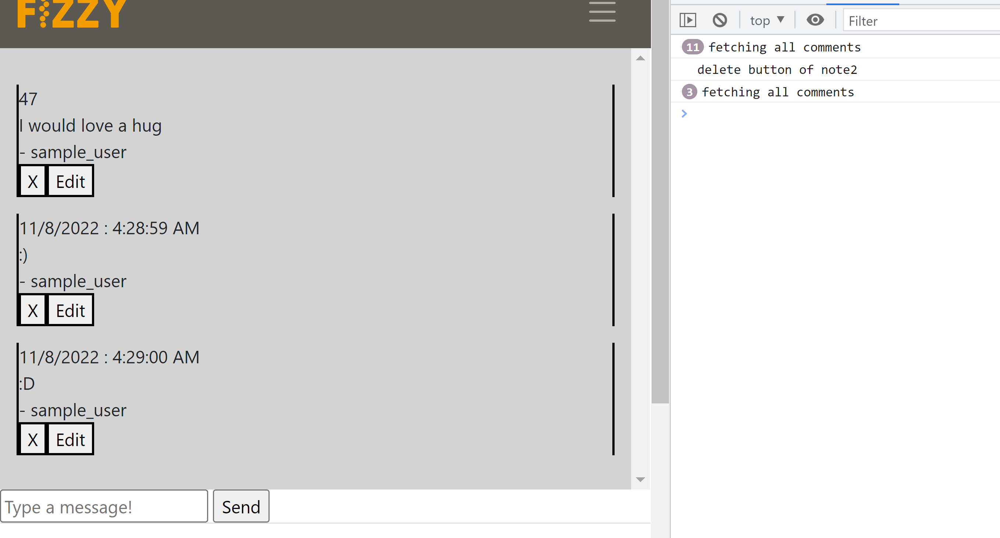

## Milestone 2

#### 0. API Documentation 

Usage examples for all of these API's are in `src/frontend/js/client.js`

##### server/server.js
> `POST comments/create`  
This API is used to insert a new comment into the server-side DB. The web-app uses it to insert 
notes using the message-field in the leftmost view of index.html.  
Expected body: 
```json
{
    "timestamp": "string",
    "user": "string",
    "msg": "string",
    "id": "number"
}
```

> `POST /comments/read`  
This API is used to read all the currently existing notes from the server-side db. It is used to
display the notes in the leftmost view of index.html, as well as continuously refresh the comments
on the user-facing display.

> `POST /comments/update`  
This API is used to update existing comments. It reads out a comment from the database, and changes
its data field based on the changes requested by the user.  
Expected body:
```json
{
    "idToUpdate": "number",
    "newText": "string",
}
```

> `POST /comments/delete`  
This API is used to delete an existing comment. It takes in a note id and uses it to delete a note 
from the server-side db.
Expected body:  
```json
{
    "idToDelete": "number",
}
```

> `GET /cfg/function_list`  
This API is used to return a list of function names for the target. This API's usecase basically
mirrors just running objdump on the target binary with the option to just look for function nanmes.

> `POST /cfg/cfg_for_func`  
This API takes in a function name and queries the targets cfg-object to return the control flow
graph for the function corresponding to the name.  
Expected body:
```json
{
    "func_name": "string",
}
```

##### server/routes/user.js  
> `GET /users`  
This API returns information about all users

> `GET /users/:id`  
This API takes in a user `id` from the get request to it and uses it to return the data about a
user-account.

> `POST /users/verify`  
This API validates a username/password from the data of a post request and communicates if this is 
a valid combination for an existing user.  
Expected body:
```json
{
    "username": "string",
    "password": "string",
}
```

> `POST /users/register`  
This API takes in a username/password from the data of a post request and uses it to register a new
user to the server-side db.  
Expected body:
```json
{
    "username": "string",
    "password": "string",
}
```

##### server/routes/stat.js  

> `GET /stats`  
This API simply returns an object that contains all the relevant high-level statistics information.

##### server/routes/source.js

> `GET /sources/list`  
This API acquires available files listed in `project_dir/` in the server.

> `GET /sources/file?path={p}`  
This API acquires file with path `p` in `project_dir/`. If the file does not
exist, 404 returned.

#### 2. Front-end Implementation

We have many different APIs for different user interfaces of our application. Since this part of the
milestone however only asks for 4 screenshots of very specific functionalities, therefore we will
showcase 4 screenshots for the Create/Read/Update/Delete operations for the notes/comments API.

> _Create_  
This screenshot showcases the comments window, and how new comments can be added to it using the
text-field and the 'send' button.  


> _Read_  
This screenshot just showcases the comments window. The read API is used to read out comments from
the server-side db and lists them on the user interface.  


> _Update_  
This screenshot showcases how the update API can be used to update a comment on the site  



> _Delete_  
This screenshot showcases how the delete API can be used to delete a comment on the site  




#### 3. Deployment
Our website is currently deployed at https://boiling-forest-11621.herokuapp.com

Automatic deployment is enabled on `main` branch.

#### Work Breakdown
We did almost all of the work on this project together in one room, so we all spent approximately
the same amount of time on this project. We were able to split the project up fairly well during
this time with everyone working on different APIs. 
